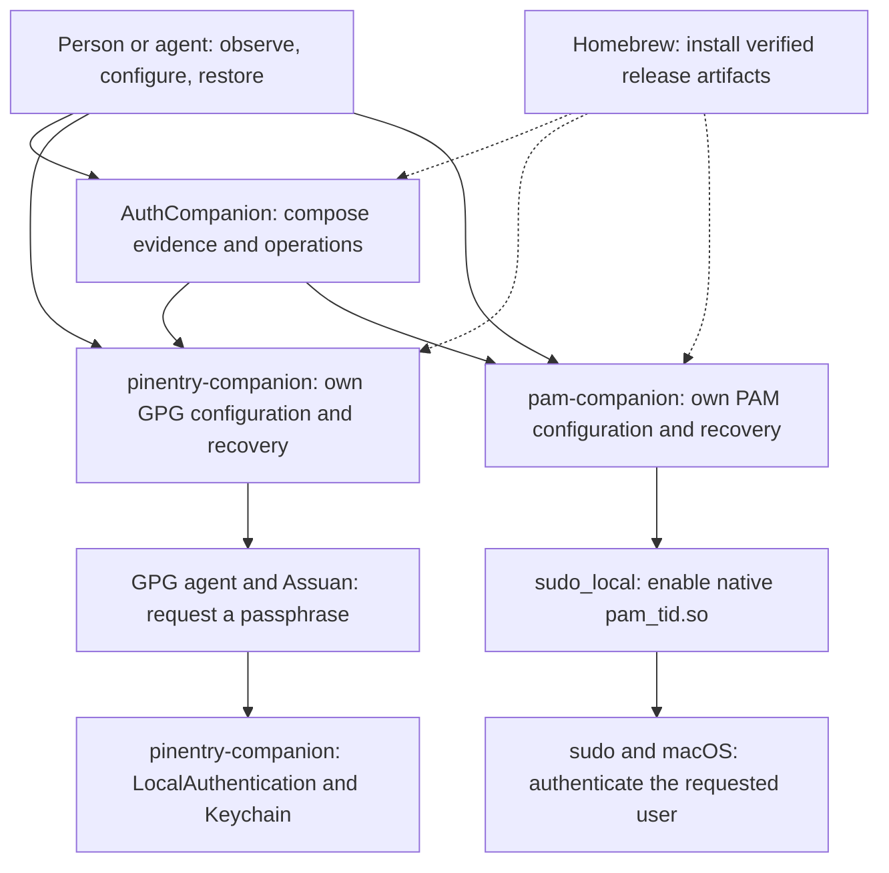

# AuthCompanion system design

AuthCompanion should make a small local authentication system understandable
and controllable by both people and agents. Its job is to explain what is
installed, what is known, what would change, and which component can make or
undo that change. It coordinates two independently useful products.

This document separates the shipped 0.1.2 architecture from work on `main` and
the remaining proposed design. The implementation plan records which changes
are complete; proposed interfaces are not release claims.
Use the [current agent guide](agent-guide.md) to operate existing releases, the
[machine contract design](agent-contract.md) for future interfaces, and the
[implementation plan](plans/2026-09-16-agent-operability.md) for delivery order.

## One system, clear owners

| Layer | Owns | Leaves to another layer |
| --- | --- | --- |
| Person or invoking agent | Desired outcome, selected target, permission to act | Credentials and biometric approval stay with the person and macOS |
| AuthCompanion | Dependency compatibility, combined plan, ordered execution, aggregate result | Component file formats, secrets, lifecycle journals |
| Component management | Inspection, planning, transaction, postcondition, recovery for its resources | The other component's state and package installation |
| Authentication mechanisms | GPG protocol and macOS authentication decisions | Suite setup and release policy |
| Homebrew and releases | Published bytes, checksums, compatible package set | Setup, sudo authorization, GPG/PAM mutation |

Each layer consumes a smaller contract than the layer beneath it implements.
AuthCompanion asks pam-companion whether its recovery record is valid; it does
not reconstruct that answer by parsing PAM files or private journals itself.
Either component remains useful without installing the suite.

Remote repositories supply installation and updates. Runtime uses accepted
local executables and local state. Neither a sibling source checkout nor a
network connection is a runtime dependency.

## Shipped baseline and actual gaps

The inspected baseline is AuthCompanion 0.1.2, pinentry-companion 0.2.0, and
pam-companion 0.1.1. Source revisions are recorded in the implementation plan.

- AuthCompanion accepts JSON for status, plan, setup, restore, and doctor. It
  fixes both component versions exactly and resolves only their Homebrew
  locations in a common prefix. It rejects root execution and uses fixed
  argument arrays with non-interactive sudo for privileged child operations.
- pinentry-companion has passive status/plan and transactional mutation JSON,
  checked-in schemas, fixtures, configuration drift checks, and recovery state.
- pam-companion has a durable root-owned transaction and native pam_tid
  management. Its source now has privileged status/doctor JSON; the published
  0.1.1 release predates that contract.
- AuthCompanion consequently infers PAM state from readable files, reduces
  component evidence to broad labels, and uses process exits for PAM results.
  Visible native policy does not establish ownership of a valid rollback record.
- A failed or interrupted command can leave state uncertain. AuthCompanion now
  preserves partial state instead of invoking enrollment restore as a general
  undo, but component mutation results still need enough detail to distinguish
  committed, reverted, and unknown effects. Existing
  `changed: false` fields do not consistently prove that nothing changed.
  Ordinary restore refers to a component's saved baseline; it is not a general
  undo of the coordinator's latest invocation.
- The process runner now captures both streams privately and enforces a live
  combined-output cap, deadline, and bounded termination. Component error
  semantics still need to distinguish a launch failure from an unobserved
  result after execution.
- The tap updates each product to its latest published release independently.
  Combined with exact runtime version pins, that needs an explicit compatibility
  check before a new component release becomes the tap default.

These are the reasons for the proposed work. Adding a daemon, agent framework,
GUI, or shared Swift package would not resolve them.

## The proposed control loop

1. **Discover the installed interface.** A small passive description identifies
   supported operations, schemas, effects, and authority requirements. It works
   when dependencies or configuration are missing.
2. **Observe enough state to answer the request.** Return installation,
   configuration, ownership, recovery, and authentication evidence separately.
   Keep inaccessible facts unknown and identify the observation that can resolve
   them.
3. **Plan a named intention.** Setup, restore, and uninstall preparation have
   distinct plans. Each lists affected resources, scope, prerequisites,
   reversibility, and the evidence on which it depends.
4. **Apply under the owning component's checks.** Bind an automated mutation to
   its reviewed target and state. Recheck under the component lock and at each
   resource transition. A stale plan cannot silently become a wider operation.
5. **Return proof and the next action.** A mutation result reports committed,
   unchanged, reverted, partial, or unknown effects and verified postconditions.
   The caller should not need another doctor call merely to learn whether the
   command completed its own contract.

The agent's authority comes from its user's task, not a JSON recommendation,
`--yes`, a state token, or an existing sudo timestamp. A returned action can be
within scope, require human interaction, or require a new decision.

## Facts have different meanings and lifetimes

| Fact | Establishes | Does not establish |
| --- | --- | --- |
| Installed and compatible | An accepted executable and contract can be used | Its configuration is correct |
| Configuration aligned | Inspected files select the intended mechanism | A component owns an exact restore point |
| Lifecycle managed and in sync | Current state matches the owner's recovery record | A biometric device can authenticate now |
| Authentication capability observed | What a named local check observed in its session | A specific signing or sudo operation was approved |
| Operation observed successful | A named operation completed in a given context | Future authorization or permanent readiness |

Configuration evidence is invalidated by file, preference, binary, target, or
journal changes. Authentication evidence can become stale when the login
session, device state, or macOS policy changes. Package metadata is stable for
an exact artifact. A receipt is historical evidence; it never replaces current
preconditions or fresh authority checks.

For example, a successful commit can use gpg-agent's cache or a key without a
passphrase. A password-only sudo prompt can reflect macOS policy. Neither
observation justifies repeatedly rewriting configuration or forcing biometric
authentication. The agent needs the unresolved fact, not a generic retry loop.

## Ownership, transactions, and recovery

pinentry-companion owns the selected user's GPG configuration, its lifecycle
record, and the account-scoped DisableKeychain preference. Preserve its existing
coordination across GPG homes. GNUPGHOME selects a configuration target, not a
different account, Keychain, or preference domain.

pam-companion owns the machine's managed PAM changes, its root-only journal,
and validated rollback files. Native pam_tid remains the authentication
mechanism. Preserve password fallback and refuse unsupported PAM shapes or
unrelated administrative drift.

AuthCompanion owns no third lifecycle database. Suite setup is a sequence of
component transactions, not an atomic transaction across the machine. A crash
may leave one component configured and the other untouched. Report that state
and plan from it; do not infer intent from an old receipt and resume silently.

Proposed compensation has a narrower rule than current ordinary restore:
undo automatically only when component evidence proves the operation belongs
to this invocation and the reverse transition preserves everything that
predated it. Pre-existing or adopted installations must survive another
component's failure. Without that proof, preserve the partial result and report
component-specific recovery. Do not build a general undo service to make every
failure appear atomic.

Restore means restoring the component's recorded pre-setup baseline. Uninstall
preparation additionally proves the binary can be removed. Secret-cache purge
is separate and irreversible. Homebrew removal is a separate package operation.
Removing only AuthCompanion need not disable either independent component.
Keep their packages installed, including preventing unintended Homebrew
autoremoval of dependencies.

## A system that becomes easier to operate over time

Useful knowledge should accumulate in artifacts an agent can verify:

- Installed command descriptions and bundled schemas explain the exact binary,
  without searching the web or reading the whole repository.
- Each result includes bounded evidence and typed next actions, so a new agent
  can continue from facts rather than replaying a transcript.
- A caller may retain a redacted receipt with the intended operation, versions,
  target scope, result, and unresolved conditions. This adds no automatic
  telemetry or suite state store.
- A discovered failure becomes a small fixture, a regression test at the owning
  layer, and a stable diagnostic entry. Update a resolved design choice in its
  owning document instead of copying it throughout the system.

Receipts, filenames, configuration contents, and diagnostics are data. Their
text never becomes instructions to run arbitrary commands. Exported reports
exclude secrets, key identities, user-specific paths, private journal metadata,
and reusable local correlation tokens by default.

The documentation ladder is short: README for installation, agent guide for
today's operation, this file for ownership, machine contract for precise
semantics, component designs and fixtures for implementation detail. The saved
plan provides the next bounded delivery step. Cross-repository links refer to
published repositories, never a developer's sibling directory.

## Resource budget and deliberate limits

A known-compatible, already configured installation should take one passive
suite status request to answer its configuration question. An unfamiliar
installed interface adds one description request. Planning carries the
observations it used; mutation carries its postconditions. Avoid the habitual
status-plan-status-doctor sequence.

Measure child process count, output bytes, latency, privileged invocations,
and human prompts for fixed scenarios. Cache static capabilities only within
one invocation and by resolved binary identity. Never cache authorization or
use a previous health result to skip a write-time check. Enforce finite process
and output budgets, with interruption classified as uncertain where needed.

Keep the system local, CLI-first, and usable without a paid Apple developer
account. Preserve the three standalone Homebrew products, manual pinentry
installation, macOS password fallback, and existing GPG-home support.
Do not add a machine enrollment registry, multi-user coordination service,
remote control endpoint, privileged daemon, LLM runtime, or automatic repair
loop. PAM changes are machine-wide; say so without inventing a household
management product.

The preferred design extends the existing CLIs. A suite-only JSON wrapper would
leave standalone products inconsistent and keep duplicated PAM interpretation.
A shared runtime would couple builds and releases. Shared semantics, owner-local
implementations, and consumer conformance fixtures provide consistency with
fewer moving parts.

One bounded legacy adapter is justified by the installed 0.x interfaces during
rollout. Ship a coordinator that accepts current and candidate components before
promoting the component upgrades. Mixed package upgrades are real; a coherent
tap commit alone does not make installation atomic. Retire the old interface
only through the published schema/product migration policy.

The weakest assumption is that existing component journals can support bounded
operation identity and conditional compensation without a general history
engine. The first implementation stage must demonstrate that. Where it cannot,
the supported outcome is explicit partial state and a new plan. Delivery is
sequential: pinentry-companion, pam-companion, then AuthCompanion and its tap
compatibility gate.
